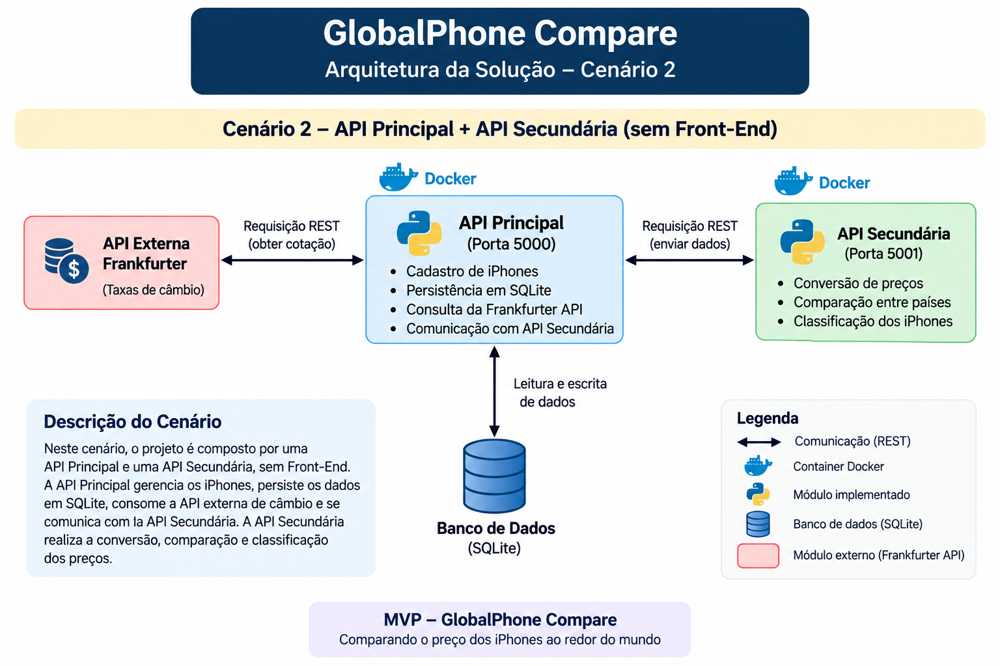

# GlobalPhone Compare API

API Principal do MVP **GlobalPhone Compare**, uma aplicação desenvolvida para cadastrar, gerenciar e comparar preços de iPhones comercializados em diferentes países.

O sistema permite armazenar preços em diferentes moedas, consultar taxas de câmbio, converter valores para Real (BRL) e comparar registros para identificar opções de compra.

O projeto utiliza uma arquitetura formada por:

- **GlobalPhone Compare API** — API Principal
- **GlobalPhone Compare Service** — API Secundária
- **Frankfurter API** — API externa de câmbio
- **SQLite** — persistência dos dados

---

# Funcionalidades

- Cadastro de iPhones
- Listagem dos iPhones cadastrados
- Atualização completa com PUT
- Atualização parcial com PATCH
- Exclusão de registros
- Persistência com SQLite
- Consulta de cotação de moedas
- Conversão de preços para Real (BRL)
- Comparação entre dois iPhones
- Comunicação REST com a API Secundária
- Integração com API externa de câmbio
- Documentação interativa com Swagger
- Execução com Docker
- Orquestração dos serviços com Docker Compose

---

# Tecnologias

- Python 3.11
- Flask
- Flask-RESTX
- Flask-SQLAlchemy
- SQLite
- Requests
- Swagger
- Docker
- Docker Compose

---

# Cenário Escolhido

Para o desenvolvimento do **GlobalPhone Compare**, foi utilizado o **Cenário 2** proposto no MVP.

Nesse cenário, a solução possui dois componentes independentes que se comunicam através de requisições REST:

```text
GlobalPhone Compare API
API Principal
        |
        | REST
        v
GlobalPhone Compare Service
API Secundária
```

A **API Principal**, executada na porta `5000`, é responsável principalmente por:

- cadastrar e gerenciar os iPhones;
- armazenar os dados em SQLite;
- consultar cotações;
- realizar operações CRUD;
- comunicar-se com a API Secundária.

A **API Secundária**, executada na porta `5001`, concentra regras de negócio relacionadas a:

- conversão de preços;
- comparação entre iPhones;
- classificação de preços;
- cálculo de economia;
- ranking de preços.

A aplicação também utiliza a **Frankfurter API** para obtenção das taxas de câmbio.

---

## Arquitetura da Solução



A comunicação da solução ocorre da seguinte forma:

- **GlobalPhone Compare API (API Principal) → GlobalPhone Compare Service (API Secundária):** comunicação REST para conversão e comparação de preços.
- **GlobalPhone Compare API (API Principal) → Frankfurter API:** consulta de taxas de câmbio.
- **GlobalPhone Compare API (API Principal) → SQLite:** leitura e persistência dos registros de iPhones.
- **GlobalPhone Compare Service (API Secundária) → GlobalPhone Compare API (API Principal):** consulta dos iPhones cadastrados através de requisições REST.
- **GlobalPhone Compare Service (API Secundária) → Frankfurter API:** consulta de cotação para conversão automática dos preços.

```text
                    Frankfurter API
                    ↙           ↘
                   ↓             ↓
        API Principal ←──────→ API Secundária
              ↕
            SQLite
```
---

# Repositórios do Projeto

O **GlobalPhone Compare** possui dois repositórios.

## API Principal — GlobalPhone Compare API

Responsável pelo cadastro, gerenciamento e persistência dos dados dos iPhones.

```text
https://github.com/biancasipas/globalphone-compare-api
```

## API Secundária — GlobalPhone Compare Service

Responsável pelas regras de negócio relacionadas à análise dos preços.

```text
https://github.com/biancasipas/globalphone-compare-service
```

---

# Estrutura do Projeto

```text
globalphone-compare-api/

├── app.py
├── requirements.txt
├── Dockerfile
├── docker-compose.yml
├── .dockerignore
├── .gitignore
├── README.md
├── database/
│   └── db.py
└── models/
    └── iphone.py
```

## Descrição dos Arquivos

- `app.py`: implementação da API Principal e suas rotas.
- `database/db.py`: configuração do SQLAlchemy.
- `models/iphone.py`: modelo utilizado para representar os iPhones.
- `requirements.txt`: dependências Python.
- `Dockerfile`: definição da imagem Docker da API.
- `docker-compose.yml`: orquestra a API Principal e a API Secundária.
- `.dockerignore`: arquivos ignorados durante o build Docker.
- `.gitignore`: arquivos que não devem ser versionados.
- `README.md`: documentação da aplicação.

---

# Banco de Dados

O projeto utiliza **SQLite** para persistência.

```text
Banco: globalphone.db

URI:
sqlite:///globalphone.db
```

Cada registro possui:

- ID
- Modelo
- Armazenamento
- Cor
- País
- Moeda
- Preço

Exemplo:

```json
{
  "id": 1,
  "modelo": "iPhone 17 Pro",
  "armazenamento": "256 GB",
  "cor": "Prata",
  "pais": "Estados Unidos",
  "moeda": "USD",
  "preco": 1099
}
```

Os valores utilizados são apenas exemplos de demonstração do MVP.

---

# Rotas da API Principal

| Método | Endpoint | Descrição |
|---|---|---|
| `GET` | `/` | Verifica se a API está funcionando |
| `GET` | `/iphones` | Lista todos os iPhones |
| `POST` | `/iphones` | Cadastra um novo iPhone |
| `PUT` | `/iphones/{id}` | Atualiza completamente um registro |
| `PATCH` | `/iphones/{id}` | Atualiza parcialmente um registro |
| `DELETE` | `/iphones/{id}` | Exclui um iPhone |
| `GET` | `/cotacao/{moeda}` | Consulta a cotação da moeda para BRL |
| `GET` | `/iphones/{id}/preco-convertido` | Converte o preço do iPhone para Real |
| `GET` | `/iphones/comparar/{id1}/{id2}` | Compara dois iPhones cadastrados |

---

# CRUD

A API implementa as principais operações de CRUD.

## GET

Consulta os registros.

```text
GET /iphones
```

---

## POST

Cadastra um novo iPhone.

```text
POST /iphones
```

Exemplo:

```json
{
  "modelo": "iPhone 17 Pro",
  "armazenamento": "256 GB",
  "cor": "Prata",
  "pais": "Estados Unidos",
  "moeda": "USD",
  "preco": 1099
}
```

---

## PUT

Realiza uma atualização completa do registro.

```text
PUT /iphones/1
```

Todos os campos devem ser informados.

Exemplo:

```text
modelo: iPhone 17 Pro
armazenamento: 256 GB
cor: Preto
pais: Estados Unidos
moeda: USD
preco: 1199
id: 1
```

---

## PATCH

Realiza uma atualização parcial.

```text
PATCH /iphones/1
```

Por exemplo, para alterar somente o preço:

```text
preco: 1099
id: 1
```

Os demais campos permanecem com seus valores anteriores.

---

## DELETE

Exclui um registro utilizando seu ID.

```text
DELETE /iphones/1
```

---

# Consulta de Cotação

## GET `/cotacao/{moeda}`

Consulta a taxa de conversão de uma moeda para Real.

Exemplo:

```text
GET /cotacao/USD
```

Exemplo de resposta:

```json
{
  "moeda_origem": "USD",
  "moeda_destino": "BRL",
  "cotacao": 5.10
}
```

A cotação é obtida através de uma API externa e pode variar conforme a data da consulta.

---

# Conversão do Preço

## GET `/iphones/{id}/preco-convertido`

Exemplo:

```text
GET /iphones/1/preco-convertido
```

O fluxo é:

```text
ID do iPhone
      ↓
SQLite
      ↓
Preço + moeda
      ↓
Consulta da cotação
      ↓
Conversão para BRL
      ↓
Resultado
```

Quando o iPhone já utiliza a moeda `BRL`, a cotação utilizada é `1.0`.

---

# Comparação de Dois iPhones

## GET `/iphones/comparar/{id1}/{id2}`

Exemplo:

```text
GET /iphones/comparar/1/2
```

A aplicação:

1. Busca os dois iPhones no SQLite.
2. Identifica as moedas.
3. Converte os valores necessários para BRL.
4. Envia os dados necessários ao Service.
5. Compara os preços.
6. Retorna a opção mais econômica.

Exemplo simplificado:

```json
{
  "iphone_1": {
    "modelo": "iPhone 17 Pro",
    "pais": "Estados Unidos"
  },
  "preco_em_reais_1": 5604.90,
  "iphone_2": {
    "modelo": "iPhone 17 Pro",
    "pais": "Brasil"
  },
  "preco_em_reais_2": 11999,
  "comparacao": {
    "melhor_opcao": "Estados Unidos",
    "economia": 6394.10
  }
}
```

---

# API Externa — Frankfurter

O projeto utiliza a **Frankfurter API** para obter taxas de câmbio.

## Endpoint utilizado

```text
https://api.frankfurter.dev/v2/rates
```

## Método

```text
GET
```

## Parâmetros

A aplicação utiliza:

```text
base
quotes
```

Exemplo:

```text
base=USD
quotes=BRL
```

Nesse caso, é solicitada a taxa de conversão de USD para BRL.

A aplicação utiliza principalmente o campo:

```text
rate
```

para realizar o cálculo.

---

# Frankfurter API

Para utilização neste MVP:

- não é necessária chave de API;
- não é necessário cadastro;
- a comunicação ocorre através de HTTPS.

Documentação:

```text
https://frankfurter.dev/
```

API:

```text
https://api.frankfurter.dev/
```

---

# Integração com o GlobalPhone Compare Service

Durante a execução local, a API Principal utiliza:

```text
http://127.0.0.1:5001
```

A configuração é realizada através da variável de ambiente:

```text
COMPARACAO_SERVICE_URL
```

O endereço padrão no código é:

```text
http://127.0.0.1:5001
```

---

# API Secundária

O **GlobalPhone Compare Service** disponibiliza rotas como:

```text
GET /
GET /converter-preco/{id}
GET /classificar-preco/{id}
GET /comparar-precos/{id1}/{id2}
GET /calcular-economia/{id1}/{id2}
GET /ranking-precos
```

Esses endpoints utilizam os dados cadastrados na API Principal.

Por exemplo:

```text
GET /converter-preco/1
```

O Service busca automaticamente o iPhone de ID `1` na API Principal e realiza a conversão.

---

# Ranking

O Service também disponibiliza:

```text
GET /ranking-precos
```

Não é necessário informar parâmetros.

O Service:

1. Busca os iPhones cadastrados na API Principal.
2. Converte os valores para BRL.
3. Ordena do menor preço para o maior.
4. Retorna o ranking.

---

# Swagger UI

Com a API Principal em execução:

```text
http://127.0.0.1:5000/
```

O Swagger permite visualizar e testar os endpoints da aplicação.

---

# Como Executar Localmente

## Pré-requisitos

- Python 3.11
- pip
- Ambiente virtual Python

## 1. Criar o ambiente virtual

```powershell
python -m venv .venv
```

## 2. Ativar

```powershell
.venv\Scripts\Activate.ps1
```

## 3. Instalar as dependências

```powershell
pip install -r requirements.txt
```

## 4. Executar a API Principal

```powershell
python app.py
```

A API ficará disponível em:

```text
http://127.0.0.1:5000
```

Para utilizar todas as funcionalidades integradas, o **GlobalPhone Compare Service** também deve estar em execução na porta `5001`.

---

# Execução do Service

Em outro terminal:

```powershell
cd globalphone-compare-service
```

Ative o ambiente virtual e execute:

```powershell
python app.py
```

O Service ficará disponível em:

```text
http://127.0.0.1:5001
```

---

# Docker

## Construir a API Principal

```bash
docker build -t globalphone-compare-api .
```

## Executar

```bash
docker run -p 5000:5000 globalphone-compare-api
```

---

# Docker Compose

O `docker-compose.yml` permite executar os dois componentes:

```text
GlobalPhone Compare API
GlobalPhone Compare Service
```

Na raiz da API Principal:

```bash
docker compose up --build
```

---

# Serviços Disponíveis

| Serviço | Endereço |
|---|---|
| API Principal | `http://127.0.0.1:5000` |
| API Secundária | `http://127.0.0.1:5001` |

---

# Swagger

## API Principal

```text
http://127.0.0.1:5000/
```

## API Secundária

```text
http://127.0.0.1:5001/
```

---

# Comunicação no Docker Compose

Dentro da rede Docker, a API Principal utiliza:

```text
http://api-secundaria:5001
```

A variável configurada é:

```text
COMPARACAO_SERVICE_URL=http://api-secundaria:5001
```

O nome `api-secundaria` corresponde ao serviço configurado no arquivo `docker-compose.yml`.

---

# Fluxo Geral

```text
Usuário
   ↓
GlobalPhone Compare API
   ↓
SQLite
   ↓
GlobalPhone Compare Service
   ↓
Frankfurter API
   ↓
Conversão / Comparação / Classificação / Ranking
```

A API Principal também pode consultar diretamente a Frankfurter em operações específicas de conversão e comparação.

---

# Objetivo do MVP

O objetivo do **GlobalPhone Compare** é demonstrar uma arquitetura composta por serviços independentes capazes de trocar dados através de APIs REST.

O projeto demonstra:

- desenvolvimento de API REST;
- CRUD completo;
- persistência em SQLite;
- comunicação entre APIs;
- consumo de API externa;
- conversão de moedas;
- comparação de preços;
- classificação de preços;
- cálculo de economia;
- ranking de preços;
- Swagger;
- Docker;
- Docker Compose.

A arquitetura permite que os iPhones sejam cadastrados uma única vez na API Principal e reutilizados pelo Service nas operações de análise.

---

# Autora

**Bianca Maria Fernandes Alves**

Projeto desenvolvido como MVP da Pós-Graduação em Desenvolvimento Full Stack da PUC-Rio.