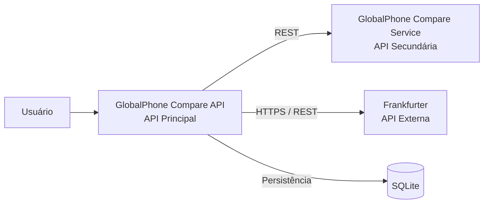

# GlobalPhone Compare API

API Principal do MVP **GlobalPhone Compare**, uma aplicação desenvolvida para cadastrar e comparar preços de iPhones em diferentes países.

O sistema permite armazenar informações de preços em diferentes moedas, consultar taxas de câmbio, converter os valores para Real (BRL) e comparar dois registros para identificar em qual país o iPhone apresenta o menor preço.

O projeto utiliza uma arquitetura composta por uma **API Principal**, uma **API Secundária**, uma **API Externa de câmbio** e persistência de dados com **SQLite**.

## Funcionalidades

- Cadastro de preços de iPhones
- Listagem dos iPhones cadastrados
- Atualização completa de registros
- Atualização parcial de registros
- Exclusão de registros
- Persistência de dados com SQLite
- Consulta de cotação de moedas
- Conversão de preços para Real (BRL)
- Comparação de preços entre dois países
- Identificação da opção mais econômica
- Cálculo da economia entre os preços comparados
- Integração REST com API Secundária
- Integração com API externa de câmbio Frankfurter
- Documentação interativa com Swagger
- Execução com Docker
- Orquestração dos serviços com Docker Compose

## Tecnologias

- Python 3.11
- Flask
- Flask-RESTX
- Flask-SQLAlchemy
- SQLite
- Requests
- Swagger
- Docker
- Docker Compose

## Estrutura do Projeto

```text
travel-planner-api/
├── app.py
├── requirements.txt
├── Dockerfile
├── docker-compose.yml
├── .dockerignore
├── README.md
├── database/
│   └── db.py
└── models/
    └── iphone.py
```

> O diretório do repositório ainda utiliza o nome `travel-planner-api`, porém a aplicação implementada corresponde ao MVP GlobalPhone Compare.

## Banco de Dados

O projeto utiliza **SQLite** para persistência dos dados.

- **Banco:** `globalphone.db`
- **URI de conexão:** `sqlite:///globalphone.db`

Cada registro de iPhone possui os seguintes dados:

- ID
- Modelo
- Armazenamento
- Cor
- País
- Moeda
- Preço

Exemplo:

```json
{
  "id": 1,
  "modelo": "iPhone 17 Pro",
  "armazenamento": "256 GB",
  "cor": "Prata",
  "pais": "Estados Unidos",
  "moeda": "USD",
  "preco": 1099
}
```

## Rotas da API Principal

| Método | Endpoint | Descrição |
|---|---|---|
| `GET` | `/` | Verifica se a API Principal está funcionando |
| `GET` | `/iphones` | Lista todos os iPhones cadastrados |
| `POST` | `/iphones` | Cadastra um novo iPhone |
| `PUT` | `/iphones/{id}` | Atualiza completamente um registro |
| `PATCH` | `/iphones/{id}` | Atualiza parcialmente um registro |
| `DELETE` | `/iphones/{id}` | Exclui um registro |
| `GET` | `/cotacao/{moeda}` | Consulta a cotação da moeda para BRL |
| `GET` | `/iphones/{id}/preco-convertido` | Converte o preço do iPhone para Real |
| `GET` | `/iphones/comparar/{id1}/{id2}` | Compara dois iPhones cadastrados |

## Exemplo de Cadastro

Endpoint:

```text
POST /iphones
```

Exemplo de payload:

```json
{
  "modelo": "iPhone 17 Pro",
  "armazenamento": "256 GB",
  "cor": "Prata",
  "pais": "Estados Unidos",
  "moeda": "USD",
  "preco": 1099
}
```

Os valores utilizados nos exemplos são dados de demonstração do MVP e não representam necessariamente os preços oficiais atuais dos produtos.

## Consulta de Cotação

A API Principal disponibiliza uma rota para consultar a conversão de uma moeda para Real.

Exemplo:

```text
GET /cotacao/USD
```

Exemplo de resposta:

```json
{
  "moeda_origem": "USD",
  "moeda_destino": "BRL",
  "cotacao": 5.1053
}
```

A cotação apresentada acima é apenas um exemplo. O valor retornado depende dos dados disponibilizados pela API externa no momento da consulta.

## Conversão do Preço

O endpoint:

```text
GET /iphones/{id}/preco-convertido
```

realiza o fluxo de integração entre os componentes.

A API Principal:

1. Busca o iPhone no SQLite.
2. Identifica a moeda do registro.
3. Consulta a cotação para BRL através da API externa Frankfurter.
4. Envia o preço e a cotação para a API Secundária.
5. A API Secundária realiza o cálculo da conversão.
6. O resultado é retornado pela API Principal.

Quando o registro já utiliza `BRL`, não é necessário consultar uma taxa de conversão.

## Comparação entre Países

O endpoint:

```text
GET /iphones/comparar/{id1}/{id2}
```

permite comparar dois registros cadastrados.

Exemplo:

```text
GET /iphones/comparar/1/2
```

Nesse fluxo, a aplicação recupera os dois iPhones no banco de dados, converte os valores necessários para Real e utiliza a API Secundária para realizar a comparação.

Exemplo simplificado de resultado:

```json
{
  "comparacao": {
    "pais_1": "Estados Unidos",
    "preco_1": 5610.72,
    "pais_2": "Brasil",
    "preco_2": 11999,
    "melhor_opcao": "Estados Unidos",
    "economia": 6388.28
  }
}
```

Os valores acima são apenas exemplos baseados nos dados de teste utilizados durante o desenvolvimento.

## Integração com a API Secundária

A API Principal se comunica via REST com o **GlobalPhone Compare Service**.

Durante a execução local, o endereço padrão utilizado é:

```text
http://127.0.0.1:5001
```

A API Secundária é responsável por operações como:

- conversão de preços;
- comparação entre dois preços;
- identificação da melhor opção;
- cálculo da economia;
- classificação de preços.

### Comunicação no Docker Compose

Dentro da rede criada pelo Docker Compose, a API Principal utiliza:

```text
http://api-secundaria:5001
```

A URL é configurada através da variável de ambiente:

```text
COMPARACAO_SERVICE_URL
```

No `docker-compose.yml`:

```text
COMPARACAO_SERVICE_URL=http://api-secundaria:5001
```

Dessa forma, a mesma aplicação pode utilizar o endereço local durante o desenvolvimento e o nome do serviço durante a execução em containers.

## API Externa - Frankfurter

O projeto utiliza a **Frankfurter API** para obter taxas de câmbio utilizadas na conversão dos preços dos iPhones para Real (BRL).

### Serviço utilizado

Frankfurter Exchange Rates API.

### Endpoint externo utilizado

```text
https://api.frankfurter.dev/v2/rates
```

### Método

```text
GET
```

### Parâmetros utilizados

A aplicação utiliza principalmente:

```text
base
quotes
```

Exemplo conceitual:

```text
base=USD
quotes=BRL
```

Nesse caso, a aplicação solicita a taxa de conversão da moeda `USD` para `BRL`.

### Dados utilizados pela aplicação

Do resultado retornado pela API, o GlobalPhone Compare utiliza principalmente:

```text
rate
```

Essa taxa é utilizada para realizar a conversão do preço do produto.

### Autenticação e cadastro

Para utilizar a API pública Frankfurter neste MVP:

- não é necessária chave de API;
- não é necessário cadastro;
- as consultas podem ser realizadas através de requisições HTTPS.

### Características do serviço

A Frankfurter fornece dados de taxas de câmbio atuais e históricas e utiliza dados provenientes de bancos centrais e outras fontes oficiais.

O projeto Frankfurter é open source.

Para este MVP, a API é utilizada exclusivamente para fins acadêmicos e de demonstração.

### Documentação oficial

Frankfurter:

https://frankfurter.dev/

API pública:

https://api.frankfurter.dev/

## Swagger UI

A documentação interativa é disponibilizada através do Swagger.

Com a API Principal em execução, acesse:

```text
http://127.0.0.1:5000/
```

O Swagger permite visualizar e testar diretamente os endpoints da aplicação.

## Como Executar

### 1. Execução Local

#### Pré-requisitos

- Python 3.11
- pip
- Ambiente virtual Python

Ative o ambiente virtual no PowerShell:

```powershell
.venv\Scripts\Activate.ps1
```

Instale as dependências:

```bash
pip install -r requirements.txt
```

Execute a API Principal:

```bash
python app.py
```

A aplicação estará disponível em:

```text
http://127.0.0.1:5000
```

Para utilizar as funcionalidades que dependem da API Secundária, o GlobalPhone Compare Service também deverá estar executando na porta `5001`.

## 2. Execução via Docker

Construa a imagem da API Principal:

```bash
docker build -t globalphone-api .
```

Execute o container:

```bash
docker run -p 5000:5000 globalphone-api
```

Para executar a arquitetura completa com comunicação entre a API Principal e a API Secundária, utilize o Docker Compose.

## 3. Execução via Docker Compose

O Docker Compose executa os dois componentes desenvolvidos:

- GlobalPhone Compare API - API Principal
- GlobalPhone Compare Service - API Secundária

Na raiz do projeto, execute:

```bash
docker compose up --build
```

### Serviços disponíveis

| Serviço | Endereço |
|---|---|
| API Principal | `http://127.0.0.1:5000` |
| API Secundária | `http://127.0.0.1:5001` |

### Swagger

API Principal:

```text
http://127.0.0.1:5000/
```

API Secundária:

```text
http://127.0.0.1:5001/
```

Para encerrar os containers:

```bash
docker compose down
```

## Arquitetura da Solução

O MVP possui três componentes principais e um mecanismo de persistência:



## Fluxo de Comunicação

1. O usuário realiza as operações através da API Principal.
2. A API Principal consulta e armazena os registros utilizando SQLite.
3. Quando uma conversão é necessária, a API Principal consulta a Frankfurter para obter a taxa de câmbio.
4. A API Principal envia os dados necessários para a API Secundária.
5. A API Secundária realiza os cálculos de conversão ou comparação.
6. A API Principal reúne as informações e retorna o resultado.
7. Os endpoints podem ser visualizados e testados através do Swagger UI.

## Docker Compose

A comunicação entre os containers utiliza:

```text
COMPARACAO_SERVICE_URL=http://api-secundaria:5001
```

O nome `api-secundaria` corresponde ao serviço definido no arquivo `docker-compose.yml`.

## Objetivo do MVP

O objetivo do **GlobalPhone Compare** é demonstrar uma arquitetura componentizada capaz de integrar diferentes serviços para resolver um problema de comparação de preços internacionais.

A solução demonstra o uso de:

- API REST
- Comunicação entre serviços
- Persistência de dados
- API externa
- Conversão de moedas
- Comparação de preços
- Swagger
- Docker
- Docker Compose

A arquitetura permite demonstrar a comunicação entre módulos independentes, persistência local e consumo de dados externos em um único fluxo.

## Autora

**Bianca Maria Fernandes Alves**

Projeto desenvolvido como MVP da Pós-Graduação em Desenvolvimento Full Stack da PUC-Rio.