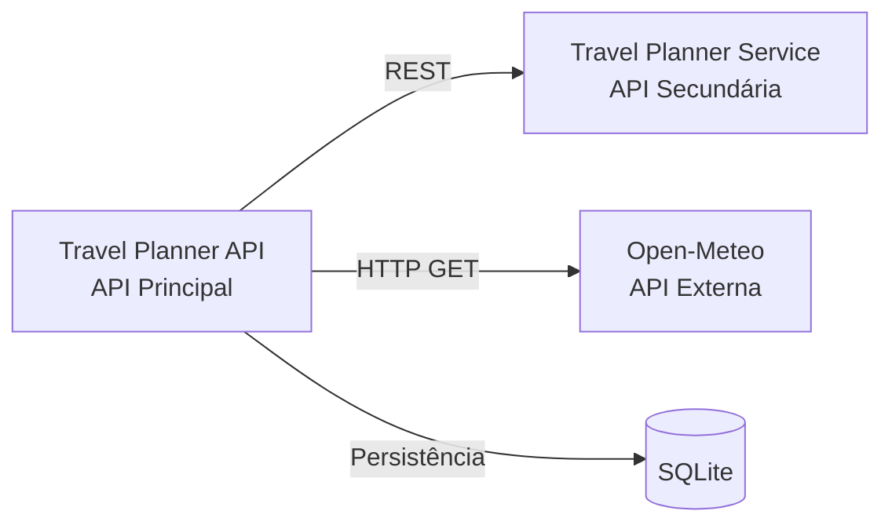

# Travel Planner API

API principal do MVP de planejamento e gerenciamento de viagens.

A aplicação é responsável pelo cadastro e gerenciamento de viagens, persistência dos dados, comunicação com uma API Secundária de planejamento e integração com uma API externa para consulta de informações climáticas.

## Funcionalidades

- Cadastro de viagens
- Listagem de viagens
- Atualização completa de viagens
- Atualização parcial de viagens
- Exclusão de viagens
- Persistência de dados com SQLite
- Integração com API Secundária para planejamento da viagem
- Integração com API externa Open-Meteo para consulta de clima
- Documentação interativa com Swagger
- Execução com Docker
- Orquestração dos serviços com Docker Compose

## Tecnologias

- Python 3.11
- Flask
- Flask-RESTX
- Flask-SQLAlchemy
- SQLite
- Requests
- Swagger
- Docker
- Docker Compose

## Estrutura do Projeto

```text
travel-planner-api/
├── app.py
├── requirements.txt
├── Dockerfile
├── docker-compose.yml
├── .dockerignore
├── README.md
├── database/
│   └── db.py
└── models/
    └── viagem.py
```

## Banco de Dados

O projeto utiliza **SQLite** como banco de dados.

- **Arquivo gerado:** `travel_planner.db`
- **URI de conexão:** `sqlite:///travel_planner.db`

O banco é utilizado pela API Principal para armazenar as viagens cadastradas.

## Rotas da API

A API Principal disponibiliza os seguintes endpoints:

| Método | Endpoint | Descrição |
|---|---|---|
| `GET` | `/` | Verifica se a API está funcionando |
| `GET` | `/viagens` | Lista todas as viagens cadastradas |
| `POST` | `/viagens` | Cadastra uma nova viagem |
| `PUT` | `/viagens/{id}` | Atualiza todos os dados de uma viagem |
| `PATCH` | `/viagens/{id}` | Atualiza parcialmente uma viagem |
| `DELETE` | `/viagens/{id}` | Exclui uma viagem |
| `GET` | `/viagens/{id}/planejamento` | Consulta o planejamento através da API Secundária |
| `GET` | `/clima` | Consulta dados climáticos através da Open-Meteo |

## Exemplo de Cadastro de Viagem

Endpoint:

```text
POST /viagens
```

Exemplo de payload:

```json
{
  "destino": "Roma",
  "data_inicio": "2027-05-10",
  "data_fim": "2027-05-20",
  "orcamento": 14000
}
```

## Integração com a API Secundária

A API Principal se comunica via REST com o serviço:

```text
travel-planner-service
```

A integração é utilizada pelo endpoint:

```text
GET /viagens/{id}/planejamento
```

A API Principal recupera os dados da viagem armazenados no SQLite e envia as informações necessárias para a API Secundária.

A API Secundária realiza o processamento do planejamento e retorna informações como:

- Destino
- Quantidade de dias
- Orçamento total
- Gasto médio por dia

Exemplo de resposta:

```json
{
  "destino": "Roma",
  "dias": 10,
  "orcamento": 14000,
  "gasto_por_dia": 1400
}
```

### Comunicação local

Durante a execução local, a API Secundária está disponível em:

```text
http://127.0.0.1:5001
```

### Comunicação no Docker Compose

Dentro da rede criada pelo Docker Compose, a API Principal utiliza:

```text
http://api-secundaria:5001
```

A URL do serviço é configurada através da variável de ambiente:

```text
PLANEJAMENTO_SERVICE_URL
```

Isso permite utilizar uma URL durante a execução local e outra durante a execução em containers.

## API Externa - Open-Meteo

A aplicação utiliza a **Open-Meteo Forecast API** para consultar informações climáticas.

A integração é realizada através do endpoint da API Principal:

```text
GET /clima
```

### Serviço utilizado

**Open-Meteo Forecast API**

### Endpoint externo utilizado

```text
https://api.open-meteo.com/v1/forecast
```

### Método utilizado

```text
GET
```

### Parâmetros utilizados

- `latitude`
- `longitude`
- `current=temperature_2m,wind_speed_10m`

### Dados utilizados pela aplicação

A aplicação utiliza os seguintes dados retornados pela Open-Meteo:

- Temperatura atual
- Velocidade atual do vento

### Exemplo de chamada na API Principal

```text
GET /clima?latitude=-19.92&longitude=-43.94
```

Exemplo de resposta:

```json
{
  "latitude": -19.92,
  "longitude": -43.94,
  "temperatura": 18.5,
  "velocidade_vento": 13.2
}
```

### Autenticação e cadastro

Para o uso gratuito e não comercial utilizado neste MVP:

- Não é necessário cadastro
- Não é necessária chave de API
- A API pode ser consumida diretamente através de requisições HTTP

### Licença e condições de uso

Os dados fornecidos pela Open-Meteo são disponibilizados sob a licença **Creative Commons Attribution 4.0 International (CC BY 4.0)**.

A API gratuita é destinada a uso não comercial e possui limites de utilização definidos pelo serviço. A atribuição à Open-Meteo é necessária conforme as condições da licença.

Este projeto utiliza a API exclusivamente para fins acadêmicos e de demonstração do MVP.

### Documentação oficial

Open-Meteo Weather Forecast API:

https://open-meteo.com/en/docs

Termos de uso:

https://open-meteo.com/en/terms

Site oficial:

https://open-meteo.com/

## Swagger UI

A documentação interativa da API é disponibilizada através do Swagger.

Com a API Principal em execução, acesse:

```text
http://127.0.0.1:5000/
```

A interface permite visualizar e testar diretamente os endpoints disponíveis.

## Como Executar

### 1. Execução Local

#### Pré-requisitos

- Python 3.11
- pip
- Ambiente virtual Python

Ative o ambiente virtual.

No PowerShell:

```powershell
.venv\Scripts\Activate.ps1
```

Instale as dependências:

```bash
pip install -r requirements.txt
```

Execute a aplicação:

```bash
python app.py
```

A API Principal estará disponível em:

```text
http://127.0.0.1:5000
```

A API Secundária deverá estar executando separadamente na porta `5001` para utilizar a funcionalidade de planejamento.

## 2. Execução via Docker

Construa a imagem da API Principal:

```bash
docker build -t travel-planner-api .
```

Execute o container:

```bash
docker run -p 5000:5000 travel-planner-api
```

A API estará disponível em:

```text
http://127.0.0.1:5000
```

> Para utilizar a integração com a API Secundária através de containers, recomenda-se utilizar o Docker Compose descrito abaixo.

## 3. Execução via Docker Compose

O Docker Compose executa de forma integrada:

- Travel Planner API - API Principal
- Travel Planner Service - API Secundária

Os dois serviços são executados na mesma rede Docker, permitindo a comunicação entre os containers.

Na raiz do projeto `travel-planner-api`, execute:

```bash
docker compose up --build
```

### Serviços disponíveis

| Serviço | Endereço |
|---|---|
| API Principal | `http://127.0.0.1:5000` |
| API Secundária | `http://127.0.0.1:5001` |

### Swagger

API Principal:

```text
http://127.0.0.1:5000/
```

API Secundária:

```text
http://127.0.0.1:5001/
```

Para encerrar os containers:

```bash
docker compose down
```

## Arquitetura da Solução

O MVP é composto por três componentes:



### Fluxo de Comunicação

1. O usuário realiza operações através da **Travel Planner API**.
2. A API Principal armazena e consulta as viagens utilizando **SQLite**.
3. Para gerar o planejamento, a API Principal envia os dados da viagem para a **Travel Planner Service** através de REST.
4. A API Secundária realiza os cálculos e retorna o planejamento para a API Principal.
5. Para consultar informações climáticas, a API Principal realiza uma requisição HTTP para a **Open-Meteo**.
6. Todos os endpoints podem ser visualizados e testados através do **Swagger UI**.

## Docker Compose

A comunicação entre os serviços dentro do Docker utiliza a variável:

```text
PLANEJAMENTO_SERVICE_URL=http://api-secundaria:5001
```

Dessa forma, a API Principal consegue localizar a API Secundária através do nome do serviço definido no `docker-compose.yml`.

## Objetivo do MVP

O objetivo deste projeto é demonstrar uma arquitetura componentizada para um sistema de planejamento de viagens, utilizando:

- API REST
- Comunicação entre serviços
- Persistência de dados
- API externa
- Swagger
- Docker
- Docker Compose

A solução demonstra a comunicação entre módulos independentes e a integração de diferentes serviços através de APIs.